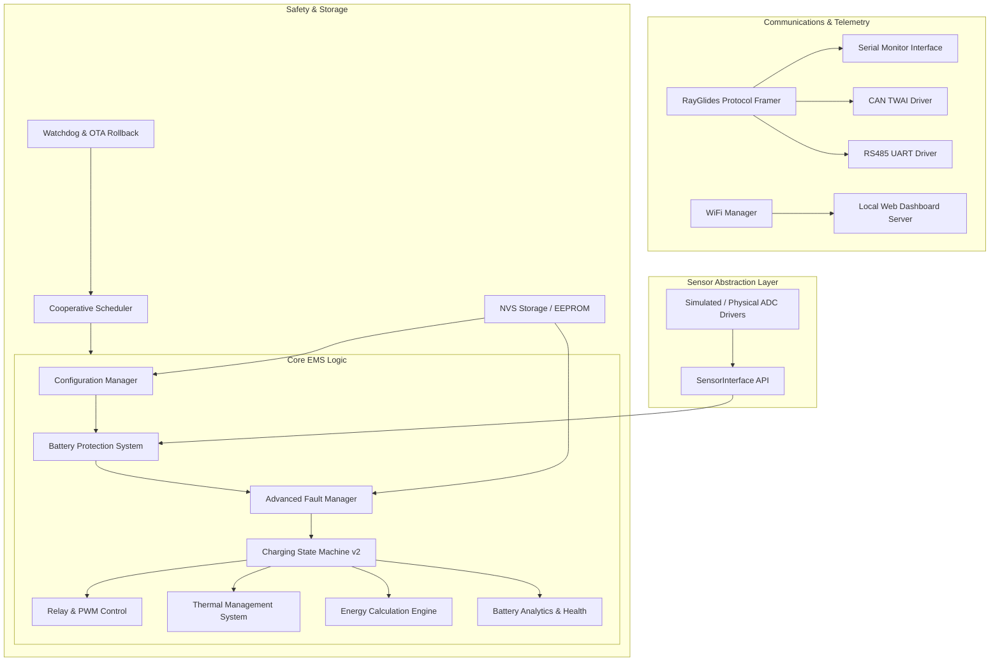

# RayGlides EMS Production-Style Firmware Architecture

This document describes the modular architecture of the RayGlides Smart Energy Management System (EMS) running on the ESP32-S3 N16R8.

---

## 1. System Block Diagram



---

## 2. Module Directory Structure

```text
firmware/
├── include/
│   ├── config.h                       # Hardcoded fallback settings and PIN mappings
│   ├── configuration/
│   │   └── ConfigManager.h            # Configuration manager structure
│   ├── sensors/
│   │   ├── SensorInterface.h          # Universal sensor abstraction layer
│   │   └── SensorSimulator.h          # Scenario simulator engine
│   ├── protection/
│   │   └── BatteryProtection.h        # Over-voltage/under-voltage/temp protection rules
│   ├── fault/
│   │   └── FaultManager.h             # Centralized fault registry
│   ├── thermal/
│   │   └── ThermalManager.h           # Coolant fan duty and power derating
│   ├── energy/
│   │   └── EnergyEngine.h             # Wh/Ah trapezoidal accumulator
│   └── analytics/
│       └── BatteryAnalytics.h         # SOC/SOH, temperature logs, and cycles tracking
├── src/
│   ├── configuration/
│   │   └── ConfigManager.cpp
│   ├── sensors/
│   │   ├── SensorInterface.cpp
│   │   └── SensorSimulator.cpp
│   ├── protection/
│   │   └── BatteryProtection.cpp
│   ├── fault/
│   │   └── FaultManager.cpp
│   ├── thermal/
│   │   └── ThermalManager.cpp
│   ├── energy/
│   │   └── EnergyEngine.cpp
│   └── analytics/
│       └── BatteryAnalytics.cpp
└── main.cpp                           # Main orchestrator
```

---

## 3. Module Responsibilities

| Module | Directory | Key Role |
| :--- | :--- | :--- |
| **Orchestrator** | `src/main.cpp` | Registers scheduler tasks, feeds watchdogs, and routes data between inputs and outputs. |
| **Scheduler** | `src/scheduler` | Tick-based cooperative scheduler to divide main loop cadence without blocking `delay()`. |
| **Config Manager** | `src/configuration` | Holds parameter structures and persists settings in NVS (Preferences). |
| **Sensor Abstraction** | `src/sensors` | Provides unified data wrappers for reading from physical ADCs or simulator engines. |
| **Simulation Engine** | `src/sensors` | Mocks 8 test scenarios (Normal, Charging, High Temp, etc.) via serial commands. |
| **Battery Protection** | `src/protection` | Evaluates safety bounds with recovery hysteresis, shutting down charge/load paths on alerts. |
| **Fault Manager** | `src/fault` | Centralized registry for active fault lists, severity classification, NVS logs, and resets. |
| **State Machine v2** | `src/battery` | Drives charge state progressions (`BOOT` -> `SELF_TEST` -> `IDLE` -> `CHARGING` -> `FAULT`). |
| **Relay & PWM Control** | `src/relay` & `src/mppt` | Drives physical power channels and adaptive pertubation MPPT loops. |
| **Thermal Manager** | `src/thermal` | Drives cooling fan speed based on thresholds and triggers power derating under heat load. |
| **Energy Engine** | `src/energy` | Integrates instantaneous V & I curves into accumulated Watt-hour (Wh) and Amp-hour (Ah) metrics. |
| **Battery Analytics** | `src/analytics` | Blends Coulomb-counting SOC with SOH health statistics, tracking min/max bounds. |
| **Communication Layer** | `src/protocol` | Handles binary packet framing, checksum validation, and command route dispatching. |
| **Hardware Bus Drivers** | `src/can` & `src/rs485` | Manages physical TWAI controller and half-duplex RS485 transceivers. |
| **Watchdog & Storage** | `src/watchdog` & `src/storage` | Manages hardware watchdogs, boot resets counters, and EEPROM emulations. |
| **Wi-Fi Manager** | `src/wifi` & `src/power` | Handles local hotspot setups and dynamic clock speed frequency scaling. |
