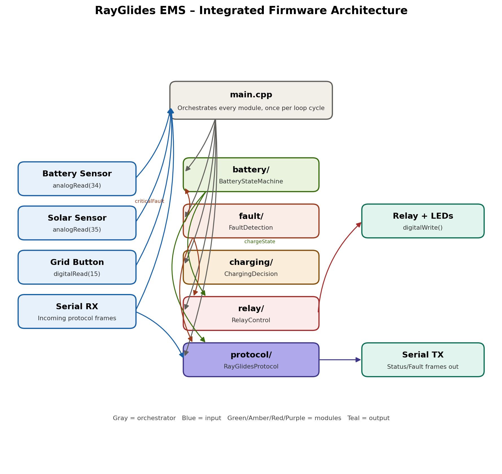

# RayGlides EMS — Integrated Firmware Architecture

## Overview

All five firmware modules are integrated through a single orchestrator,
`main.cpp`, which runs one full pass through every module each loop cycle
(every `LOOP_DELAY_MS`, currently 500ms). No module calls another module
directly except where explicitly noted below — `main.cpp` is the only
place that reads sensor inputs, sequences the modules, and applies outputs.
This keeps each module independently testable and prevents circular
dependencies between them.

## Integration Order (per loop cycle)

1. **Battery Monitoring** (`battery/`) reads the battery sense pin and
   computes state of charge (SOC).
2. **Fault Detection** (`fault/`) reads the same raw battery value (plus
   the communication watchdog state) and returns a debounced fault code
   and severity.
3. **Communication receive** (`protocol/`) checks for any incoming frame
   and validates its checksum, raising `F009` internally if corrupted.
4. **Battery State Machine** (`battery/`) combines SOC and the fault's
   criticality to decide the next charge state (IDLE / CHARGING /
   FULLY_CHARGED / FAULT).
5. **Relay Control** (`relay/`) takes the resulting charge state *and* the
   active fault, and decides the physical relay position and indicator
   LEDs — enforcing a safety interlock that overrides the state machine's
   output whenever a critical fault is present.
6. **Charging Decision** (`charging/`) independently reads the solar and
   grid inputs and decides Solar Only / Grid Only / Hybrid / No Charge.
   This module does not depend on the battery state machine's output -
   it runs in parallel, since source selection and charge-state tracking
   are separate concerns.
7. **Communication send** (`protocol/`) reports the current SOC and charge
   state as a `STATUS_UPDATE` frame every cycle, and a `FAULT_REPORT`
   frame whenever the active fault code changes.

## Why This Structure

- **Single point of orchestration.** Only `main.cpp` sequences the
  modules, so the integration logic (what runs before what, and which
  outputs feed which inputs) lives in one readable place rather than
  being scattered across modules calling each other.
- **Explicit data dependencies.** Modules take their inputs as function
  parameters (e.g. `evaluateBatteryState(currentState, soc, criticalFault)`,
  `updateRelay(chargeState, activeFault)`) rather than reading global
  state directly wherever possible - so the dependency between, say,
  Fault Detection and Relay Control is visible in the function signature,
  not hidden inside the module.
- **Safety-critical output isolated.** Relay Control is deliberately the
  last decision-making step before hardware is touched, and is the one
  module allowed to override another module's result (the state
  machine's) - this mirrors real EMS design practice, where the
  safety interlock sits closest to the actuator, not buried upstream.
- **Independent charging-mode selection.** Solar/Grid/Hybrid selection
  intentionally does not block on or depend on the battery state machine,
  since source selection can be evaluated even while, for example, the
  system is in `FULLY_CHARGED` and not currently drawing charge - keeping
  these concerns decoupled avoids one module needing to know the internal
  details of another.

## What Changed From the Standalone Modules

Prior to this integration, `RelayControl` had no independent existence -
its logic (drive LED, imply relay state) was embedded directly inside
`BatteryStateMachine`. It has since been pulled out into its own module
specifically so this integration step has a clear "safety layer" that
combines two upstream modules' outputs (state + fault) rather than one
module quietly doing double duty.
